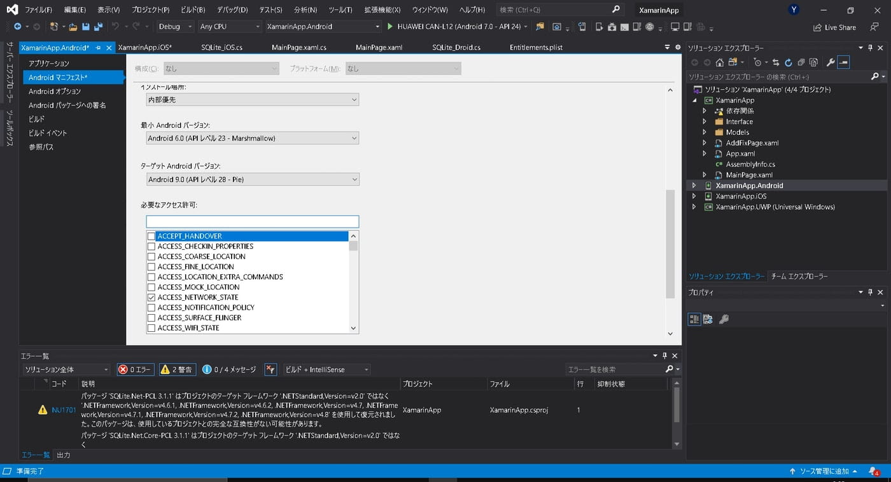
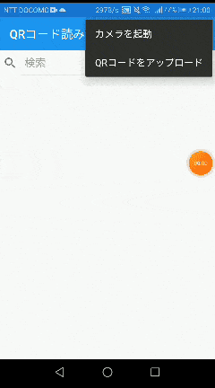

Xamarin.FormsでQR読み取り機能を実装したので、メモしておきます。

当方、現時点でiOS実機でのビルドが出来ておりませんが、エミュレータでURL取得後のブラウザ起動を確認しているので問題なく動作するはずです。環境が整い次第、追記します。

<TOC headings={getHeadings()} />

## 環境・前提条件

- Windows10
- Visual Studio 2019 V16.6.3（C#）
- Xamarin.Forms V4.5.0.617
- HUAWEI Nova 2 Android 7.0

## 準備するもの
ZXing（Zebra Crossing ゼブラクロッシングと読むらしい） というバーコード読み取りのライブラリがあるみたいなので、これを使っていきます。
事前準備として、Nugetで下記の3つをインストール。

-  **ZXing.Net.Mobile**
-  **ZXing.Net.Mobile.Forms**
-  **Xamarin.Essentials**

### Zxingパッケージ
①と②は、先述したバーコード読み取り。片方だけだと動いてくれないので、両方必要です。
名前の似たようなものがたくさんあるので注意してください。

たぶん、上の方に出てくる。はず...

### Xamarin.Essentials
3つ目はAndroid、iOS、UWP各プラットフォームの固有APIを利用できるライブラリになります。
プラットフォーム依存のAPI（位置情報とか各種センサー等）を呼び出すコードを共通化してくれる優れものです。この中に、アプリケーション内からWebリンクを開ける<span class="marker-halfRed" style="font-size: 12pt;">**Browserクラス**</span>が入ってます。

サポートは下記参照\
Android 4.4（API 19）以上\
iOS 10.0 以上\
UWP 10.0.16299.0 以上\

Visual Studio 2019からはプロジェクト作成時にインストールされているみたいなのですが、
僕のところには何故か入ってなかったので一応。


## 作り方
以下の手順で作成していきます。

1. **Manifest設定**
2. **Appクラスの修正**
3. **初期画面を作る**
4. **コードビハインドに、ZXingのイベントハンドラを作成**
5. **QRコードからの取得データをBrowserクラスで開く**


### Manifest設定
プロジェクトのプロパティの[Android Manifest]から [Required permissions]で"CAMERA"と"FLASHLIGHT"の権限を取っておきます。



または、AndroidManifest.xmlに直接追加することもできます。以下を manifestタグの中に入れてやってください。

```xml
<!--AndroidManifest.xml-->
<uses-permission android:name = "android.permission.CAMERA" >
<uses-permission android:name = "android.permission.FLASHLIGHT" >
```

### Appクラスの修正
NavigationPageをMainPageに設定します。
これを行うことで、ナビゲーションスタックに、ルートページとなる初期画面がプッシュされます。

```csharp
// App.xaml.cs
using System;
using Xamarin.Forms;
using Xamarin.Forms.Xaml;

namespace XamarinApp
{
    public partial class App : Application
    {
        public App()
        {
            InitializeComponent();
            MainPage = new NavigationPage(new MainPage() { });
        }
    }
}
```

### iOSの初期設定
Xamarin.Formsの初期化処理であるglobal::Xamarin.Forms.Forms.Init();の後ろに、

global::ZXing.Net.Mobile.Forms.iOS.Platform.Init();
という、ZXingの初期化処理を入れてあげます。

&nbsp;

```csharp
//AppDelegate.cs
using System;
using System.Collections.Generic;
using System.Linq; using Foundation;
using UIKit;

namespace XamarinApp.iOS
{
    [Register("AppDelegate")]
    public partial class AppDelegate : global::Xamarin.Forms.Platform.iOS.FormsApplicationDelegate
    {
        public override bool FinishedLaunching(UIApplication app, NSDictionary options)
        {
            global::Xamarin.Forms.Forms.Init();
            global::ZXing.Net.Mobile.Forms.iOS.Platform.Init();
            LoadApplication(new App());
            return base.FinishedLaunching(app, options);
        }
    }
}
```

### 初期画面を作る
アプリが起動して、最初に表示される画面を作成していきます。
今回は、あくまでQRコードの動作確認用、サンプルアプリですので、簡単に作っていきます。

以下のコードをMainPage.xamlに入力。

```xml
<!--MainPage.xaml-->
<?xml version="1.0" encoding="utf-8"?>
<ContentPage
xmlns="http://xamarin.com/schemas/2014/forms"
xmlns:x="http://schemas.microsoft.com/winfx/2009/xaml"
xmlns:d="http://xamarin.com/schemas/2014/forms/design"
xmlns:mc="http://schemas.openxmlformats.org/markup-compatibility/2006"
mc:Ignorable="d"
x:Class="XamarinApp.MainPage">

    <ContentPage.Padding>
        <OnPlatform x:TypeArguments="Thickness">
            <On Platform="iOS">0,20,0,0</On>
        </OnPlatform>
    </ContentPage.Padding>

    <ContentPage.ToolbarItems>
        <ToolbarItem x:Name="menuDate" Order="Primary"/>
        <ToolbarItem x:Name="cameraItem" Text="カメラを起動" Order="Secondary" Clicked="Camera_Button"/>
    </ContentPage.ToolbarItems>
```

今回は、Toolbarに「カメラを起動」という名前のアイテムを設置しました。 もちろん、ButtonにしてもOKです。 Clickedイベントに、Camera_Buttonを割り当てておきます。

途中のContantPage.Paddingタグですが、iOSのみ上部に20pxの余白を作っています。 これをしておかないと、iOSでは設置したコントロールが上部に隠れてしまうので、Xamarin.Formsでのアプリ開発ではこのPaddingの定義が必要です。


### コードビハインドに、ZXingのイベントハンドラを作成
先ほど作成したToolbarItemに処理を書いていきます。

```csharp
/// <summary>
/// カメラを起動
/// </summary>
/// <param name="sender"></param>
/// <param name="e"></param>
private async void Camera_Button(object sender, EventArgs e)
{
    var scanner = new ZXingScannerPage()
    {
        DefaultOverlayTopText = "バーコードを読み取ります",
        DefaultOverlayBottomText = "読み取り開始"
    };
    await Navigation.PushAsync(scanner);

    scanner.OnScanResult += (result) =>
    {
        scanner.IsScanning = false;
        Device.BeginInvokeOnMainThread(async () =>
        {
            await Navigation.PopAsync();

            await Browser.OpenAsync(result.Text, new BrowserLaunchOptions
            {
                LaunchMode = BrowserLaunchMode.SystemPreferred,
                TitleMode = BrowserTitleMode.Default
            });
        });
    };
}
```

実装方法はこんな感じ。

ZXingScannerPageというスキャナーページを生成し、OnScanResulでスキャン完了のイベントハンドラを記述しています。

そして、スキャンページ遷移後のバックグラウンドスレッドから。UIスレッドを操作するためにDevice.BeginInvokeOnMainThreadで、UIを操作する処理を囲んであげます。ここでは、初期画面に戻るためのポップ処理ですね。

プラットフォームごとに、様々な機能をカスタマイズできるDeviceクラスのメソッドです。

### QRコードからの取得データをBrowserクラスで開く
前項で、スキャンが出来るようになったのはいいけど、...

この状態では、スキャン完了したら、初期画面に戻るだけです。ここで、戻る前にブラウザを起動させる処理を追加します。


```csharp
//MainPage.xaml.cs
Device.BeginInvokeOnMainThread(async () => {
    await Browser.OpenAsync(result.Text, new BrowserLaunchOptions
    {
        LaunchMode = BrowserLaunchMode.SystemPreferred,
        TitleMode = BrowserTitleMode.Default
    });

    await Navigation.PopAsync();
});
```

Device.BeginInvokeOnMainThreadの中に、BrowserクラスのOpenAsyncメソッドを追加します。
OpenAsyncメソッドにスキャン結果(URLが入ったresult)とLaunchOptionsを設定することで、アプリケーション内からWEBリンクを開くことができます。

* **LaunchMode = BrowserLaunchMode.SystemPreferred**
    **LaunchMode = BrowserLaunchMode.External**
* **TitleMode = BrowserTitleMode.Default**
    **TitleMode = BrowserTitleMode.Hide**
    **TitleMode = BrowserTitleMode.Show**

両者とも、起動方法に関するプロパティです。

LaunchModeですが、前者がブラウザを選択してアプリ内からリンクを開くのに対し、後者がブラウザの選択後、アプリ外でリンクを開くという違いがあります。

TitleModeは、リンクを開いている間、Webページのタイトルを上部に表示するかどうか設定できます。Defaultにしておくことで、表示になります。

## 動作確認
Androidで動かします。iOSは実機が使えないので出来ましぇん。UWPもカメラが手元にないので割愛。

何でXamarin.Formsにしたしw

### Android
サンプルソースと、ちょっとUIが違うのは勘弁してください。




さいごに
----
読み取りメッチャ速い(・∀・)

今Prismを勉強中なので、今回のPrism版もまた今度ね。

その前にiOSビルドのための実機が必要だよね。ipod touch 7とかでいいんでしょうか。

## 参考
https://devblogs.microsoft.com/xamarin/barcode-scanning-made-easy-with-zxing-net-for-xamarin-forms/

https://qiita.com/ytabuchi/items/3e14dcb5b9a11aaf14a9

https://github.com/xamarin/Essentials/tree/main/Xamarin.Essentials/Browser

https://docs.microsoft.com/ja-jp/dotnet/api/xamarin.essentials.browser